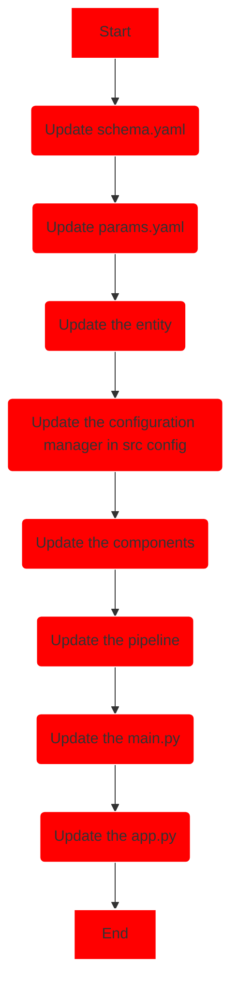

# **Chest-Cancer-Classification-Using-mlflow-and-DVC**

## **Problem Statement:**

- The objective of this project is to develop a deep learning model capable of predicting breast cancer risk and subtype, specifically adenocarcinoma, using chest CT scan images. The model will be trained and tested on a limited dataset comprising chest CT scan images of women diagnosed with adenocarcinoma breast cancer as well as those without the disease. The model's performance will be evaluated based on its accuracy and loss metrics. The anticipated outcome of this project is to introduce a novel and effective method for breast cancer prediction, which can facilitate the early detection and diagnosis of the disease, as well as contribute to the personalized treatment and management of patients.

## Workflow🐍


## 🚀 Training Pipeline

<details>
<summary>Open Here!</summary>




</details>

## Usage

To run this project locally, follow these steps:

### Step 1: Clone the repository

```bash
<https://github.com/samad-ms/Chest-Cancer-Classification-Using-mlflow-and-DVC.git>

```

### STEP 2: Create a conda environment after opening the repository

```bash
conda create -n ML_project python=3.10 -y

```

```bash
conda activate ML_project

```

### STEP 3- Install the requirements

```bash
pip install -r requirements.txt

```

```bash
# Finally run the following command
python app.py

```

## MLflow

[Documentation](https://mlflow.org/docs/latest/index.html)

### `commands for mlflow_ui`

1. Open [Dagshub](https://dagshub.com/).
2. Connect with your GitHub repo.
3. Copy these details

> MLFLOW_TRACKING_URI= your tracking uri
MLFLOW_TRACKING_USERNAME= username
MLFLOW_TRACKING_PASSWORD=password
> 
1. Open **git bash/terminal**
2. Run this to export as env variables:

```bash
export MLFLOW_TRACKING_URI=your uri
export MLFLOW_TRACKING_USERNAME=username
export MLFLOW_TRACKING_PASSWORD=password

```

## AWS-CICD-Deployment-with-Github-Actions

### 1. Login to AWS console.

### 2. Create IAM user for deployment

### With specific access

1. **EC2 access**: It is a virtual machine
2. **ECR**: Elastic Container registry to save your docker image in AWS.

### Description: About the deployment

```
1. Build docker image of the source code

2. Push your docker image to ECR

3. Launch Your EC2

4. Pull Your image from ECR in EC2

5. Lauch your docker image in EC2

-> Policy:

1. AmazonEC2ContainerRegistryFullAccess

2. AmazonEC2FullAccess

```

### 3. Create ECR repo to store/save docker image

```
- Save the URI: 566373_____.dkr.ecr.ap-south-1.amazonaws.com/ML_project

```

### 4. Create EC2 machine (Ubuntu)

### 5. Open EC2 and Install docker in EC2 Machine:

```
-> optinal

sudo apt-get update -y

sudo apt-get upgrade

-> required

curl -fsSL <https://get.docker.com> -o get-docker.sh

sudo sh get-docker.sh

sudo usermod -aG docker ubuntu

newgrp docker

```

### 6. Configure EC2 as self-hosted runner:

```
setting>actions>runner>new self hosted runner> choose os> then run command one by one

```

### 7. Setup github secrets:

```
AWS_ACCESS_KEY_ID=

AWS_SECRET_ACCESS_KEY=

AWS_REGION = us-east-1

AWS_ECR_LOGIN_URI = demo>>  5663_____2.dkr.ecr.ap-south-1.amazonaws.com

ECR_REPOSITORY_NAME = simple-app

```
